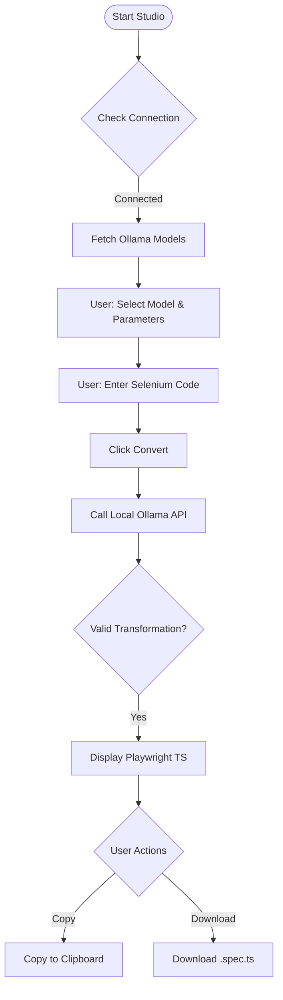

# 🚀 Selenium to Playwright Convertor (Local LLM)
### High-Precision. Privacy-First. Automated QA Migration.

A **Privacy-First, AI-Powered Conversion Tool** that automatically translates legacy Selenium Java code into idiomatic Playwright TypeScript. Powered by **Ollama (CodeLlama)** running locally on your machine—ensuring your proprietary code never leaves your network.

---

## 🏗️ Architecture
The system follows a 3-Layer Deterministic Architecture designed for maximum security, zero latency, and zero data leaks.



---

## ✨ Features
*   **100% Local Execution**: Uses Ollama + CodeLlama. No API keys, no cloud costs, no third-party data dependency.
*   **Modern UI**: High-readability dashboard featuring **Glassmorphism design**, optimized for long-form code reviews.
*   **Smart Conversion Engine**: 
    *   Translates `driver.findElement` → `page.locator`.
    *   Converts **TestNG/JUnit** Annotations → Playwright Hooks.
    *   Handles **Explicit & Implicit Waits** automatically.
    *   Map Selenium Actions → Playwright `getByRole`, `getByLabel`, etc.
*   **Zero-Config Launchers**: One-click startup for macOS and Windows that handles environment validation and dependency installation.

---

## 🛠️ Prerequisites
*   **Python 3.9+** installed.
*   **Ollama** installed and running.
    *   [Download Ollama](https://ollama.ai/)
    *   Pull the model: `ollama pull codellama`

---

## 🚀 Quick Start

### 1. Clone the Repository
```bash
git clone https://github.com/sakhi-shraddha-sst/AI-Selenium2Playwright-NativeLLM.git
cd AI-Selenium2Playwright-NativeLLM
```

### 2. Launch the Application
The system is designed for zero manual setup. Simply run the launcher for your OS:

- **macOS**: 
  ```bash
  ./launch_mac.command
  ```
- **Windows**: 
  ```bash
  launch_windows.bat
  ```

*The script will automatically install Flask dependencies, start the backend, and open the UI at `http://localhost:5001`.*

---

## 🧩 Project Structure
```text
├── app.py                 # Flask Backend (Orchestrates UI & Ollama)
├── tools/
│   └── converter.py       # Core AI Conversion Logic & Prompt Engineering
│   └── handshake.py       # Ollama Connectivity Witness
├── ui/
│   ├── templates/         # HTML Transformation Interface
│   └── static/            # CSS Glassmorphism Styles & Assets
├── architecture/          # Standard Operating Procedures (SOPs)
├── launch_mac.command     # macOS One-Click Starter
└── launch_windows.bat     # Windows One-Click Starter
```

---

## 🤝 Contributing
1. Fork the repository.
2. Create a feature branch (`git checkout -b feature/amazing-feature`).
3. Commit your changes (`git commit -m 'Add amazing feature'`).
4. Push to the branch (`git push origin feature/amazing-feature`).
5. Open a Pull Request.

---
**Built with ❤️ for the QA Community.**
*Focused on Engineering Efficiency and Data Sovereignty.*
