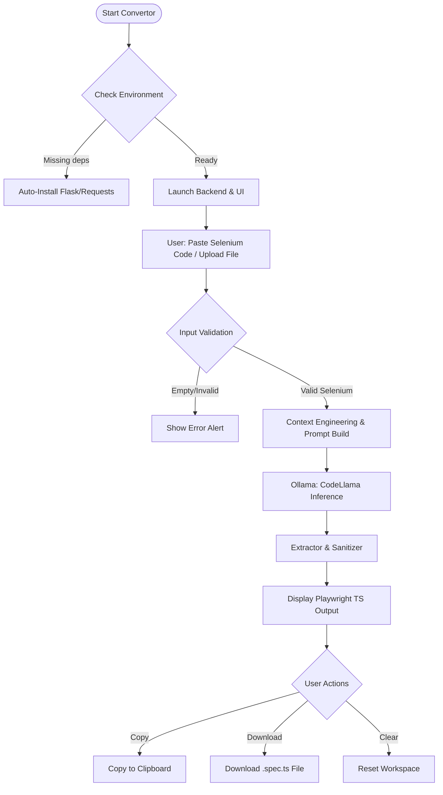

# Selenium to Playwright Convertor (CodeLlama Native)
### High-Precision. Local-First. Automation Engineering at Scale.

**Selenium to Playwright Convertor** is a **professional-grade, privacy-first** transformation engine designed for automation architects to migrate legacy Selenium suites to modern Playwright infrastructure. By leveraging **Local LLMs (via Ollama - CodeLlama)** and a high-performance **cyber-futuristic UI**, it provides a deterministic bridge between Java/Selenium and TypeScript/Playwright—all while keeping your proprietary test logic **100% on your local hardware**.

---

## 🏗️ Technical Pipeline (How It Works)

The convertor operates on an atomic, three-layer deterministic architecture to ensure code runnability and logic preservation.



1. **Validation Layer**: Heuristic checks detect empty inputs, non-Selenium content, or already-converted Playwright code before inference begins.
2. **Context Engineering**: Dynamically constructs system prompts that enforce `@playwright/test` framework standards, modern locators (getByRole), and async/await consistency.
3. **Deterministic Output**: Uses a temperature of 0.0 to ensure that identical Selenium inputs always yield identical, reproducible Playwright transformations.

---

## 🚀 Key Technical Features

*   **⚡ Local Compute Sovereignty**: Direct integration with **Ollama** and **CodeLlama** ensures that your test logic never leaves your internal network, satisfying strict enterprise security requirements.
*   **🛠️ Framework Runnability**: Unlike generic AI assistants, this engine is optimized to produce **full Playwright Test files**, including necessary imports, test wrapper blocks, and modern locator strategies—ready for `npx playwright test`.
*   **📦 Smart One-Click Launchers**: Integrated `.command` (macOS) and `.bat` (Windows) scripts that automatically:
    *   Verify Python and Ollama environments.
    *   Install necessary backend dependencies (`Flask`, `requests`).
    *   Initialize the local server and auto-open the UI in the default browser.
*   **🛡️ Edge-Case Protection**: Built-in scanners for common conversion pitfalls, preventing "hallucinated" code and ensuring the transformer remains within the bounds of standard automation APIs.
*   **🎨 Pro-Grade UX**: A high-readability glassmorphism dashboard featuring real-time status monitoring, logic clear-down, and smooth file-system integration for uploads and downloads.

---

## 🛠️ Quick Start

### **1. Launching the Convertor**
The system is designed for zero-configuration deployment. Simply use the smart launcher for your OS:

- **macOS**: Double-click `launch_mac.command`
- **Windows**: Double-click `launch_windows.bat`

*The script will validate your environment, start the Flask service, and open the UI automatically.*

### **2. AI Infrastructure Setup**
Ensure **Ollama** is installed and the base model is available on your machine:

```bash
# Pull the specialized code conversion model
ollama pull codellama
```

---

## 🧬 Architectural Invariants

To maintain high reliability, the system adheres to these core B.L.A.S.T. laws:
- **Data Contract Supremacy**: All internal data flows are governed by strict JSON schemas defined in `gemini.md`.
- **Logic Preservation**: The transformer is forbidden from inventing selectors or business logic. If a mapping is unknown, it must insert a descriptive `// TODO`.
- **Stateless Inference**: Each conversion is an independent, atomic operation with no shared state to prevent cross-contamination of test logic.

---

## 📑 Technical License
Proprietary engineering tool designed for internal Automation Excellence. 

---
*Developed with a focus on Engineering Efficiency and Data Sovereignty.*
