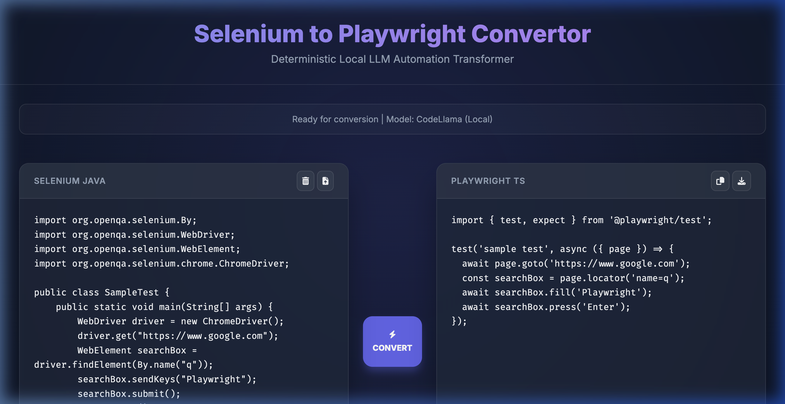
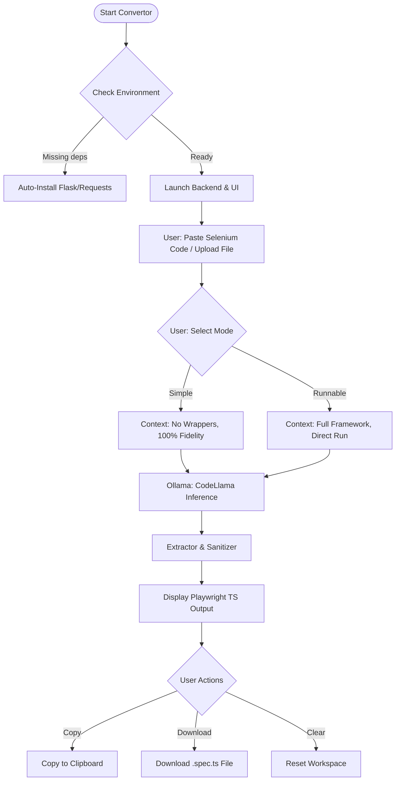

# 🚀 Selenium to Playwright Convertor (Local LLM)
### High-Precision. Local-First. Automation Engineering at Scale.

**Selenium to Playwright Convertor** is a **professional-grade, privacy-first** transformation engine designed for automation architects to migrate legacy Selenium suites to modern Playwright infrastructure. Powered by **Ollama (CodeLlama)** running locally on your machine—ensuring your proprietary code never leaves your network. **100% on your local hardware**.



---

## 🏗️ Architecture
The system follows a 3-Layer Deterministic Architecture designed for maximum security, zero latency, and zero data leaks.



1.  **Validation Layer**: Heuristic checks detect empty inputs, non-Selenium content, or already-converted Playwright code before inference begins.
2.  **Dual-Path Context Engineering**: 
    -   **Simple Mode**: Strips framework boilerplate to return precise, injectable logic snippets.
    -   **Runnable Mode**: Wraps logic in a complete `@playwright/test` structure for immediate execution.
3.  **Deterministic Output**: Uses a temperature of 0.0 to ensure that identical Selenium inputs always yield identical, reproducible Playwright transformations.

---

## ✨ Features
*   **100% Local Execution**: Uses Ollama + CodeLlama. No API keys, no cloud costs, no data leaks.
*   **🔄 Dual Conversion Modes**:
    *   **Simple Converter**: Focuses on extreme logic fidelity. Returns ONLY the converted code lines, perfect for manual injection into existing suites.
    *   **Runable Conversion**: Generates a complete, ready-to-run Playwright test file including imports, test blocks, and modern assertions.
*   **Modern UI**: Built with a high-performance **Glassmorphism design** featuring clear-down functionality and instant status feedback.
*   **Smart Conversion Rules**:
    *   Translates `driver.findElement` → `page.locator`.
    *   Converts **TestNG/JUnit** Annotations → Playwright Hooks.
    *   Handles **Waits and Actions** using modern async/await patterns.
*   **Zero-Config Launchers**: One-click startup for macOS and Windows that handles environment validation and dependency installation.

---

## 🛠️ Prerequisites
*   **Python 3.9+** installed.
*   **Ollama** installed and running.
    *   [Download Ollama](https://ollama.ai/)
    *   Pull the model: `ollama pull codellama`

---

## 🚀 Quick Start

### 1. Clone the Repository
```bash
git clone https://github.com/sakhi-shraddha-sst/AI-Selenium2Playwright-NativeLLM.git
cd AI-Selenium2Playwright-NativeLLM
```

### 2. Launch the Application
The system is designed for zero manual setup. Simply run the launcher for your OS:

- **macOS**: 
  ```bash
  ./launch_mac.command
  ```
- **Windows**: 
  ```bash
  launch_windows.bat
  ```

*The script will automatically install Flask dependencies, start the backend, and open the UI at `http://localhost:5001`.*

---

## 🧩 Project Structure
```text
├── app.py                 # Flask Backend (Orchestrates UI & Ollama)
├── tools/
│   └── converter.py       # Core AI Conversion Logic & Prompt Engineering
│   └── handshake.py       # Ollama Connectivity Witness
├── ui/
│   ├── templates/         # HTML Transformation Interface
│   └── static/            # CSS Glassmorphism Styles & Assets
├── architecture/          # Standard Operating Procedures (SOPs)
├── launch_mac.command     # macOS One-Click Starter
└── launch_windows.bat     # Windows One-Click Starter
```

---

## 📑 Technical License
Proprietary engineering tool designed for internal Automation Excellence. 

---
**Built with ❤️ for the QA Community.**
*Focused on Engineering Efficiency and Data Sovereignty.*
